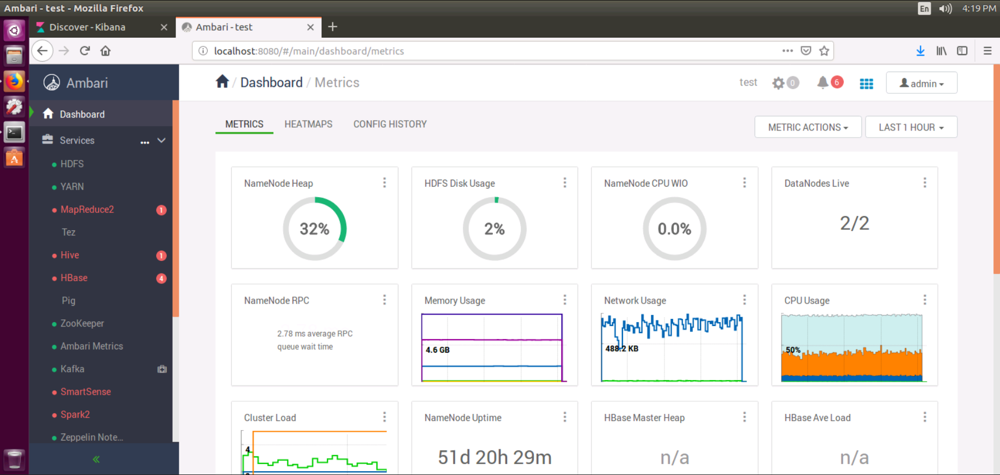
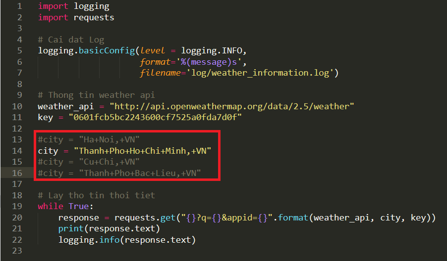
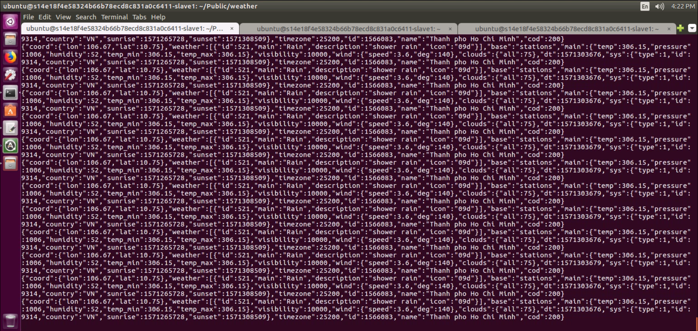
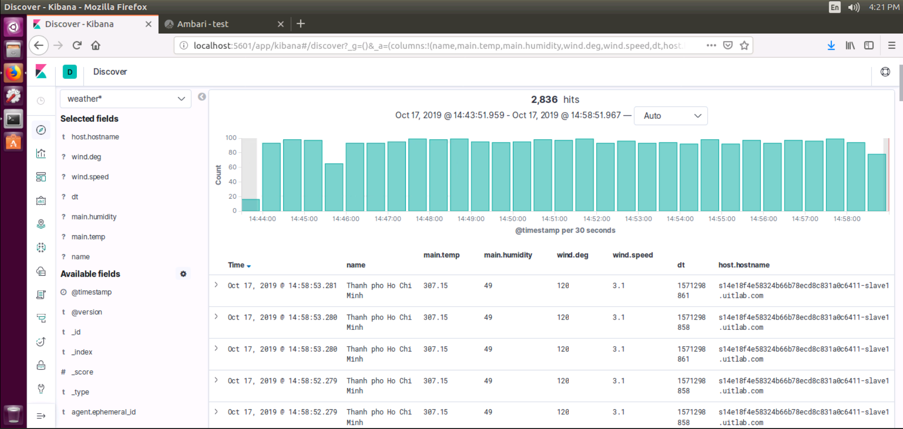

# real-time-weather
**Mục tiêu**: Xem thông tin thời tiết theo thời gian thực bằng các sử dụng Kafka và ELK (Filebeat, Lostash, Elasticsearch, Kibana)

Điều kiện ban đầu:
------------------
- Cấu hình cụm máy server:
  * master : **10.255.255.6**
  * slave1 : **10.255.255.7**
  * slave2 : **10.255.255.8**
  * slave3 : **10.255.255.9**
  * slave4 : **10.255.255.10**
- Cấu hình phần mềm Ambari:
  * Storages: **HDFS**
  * Resource Management: **YARN**
  * Management & Coordination: **ZOOKEEPER**
  * Streaming: **Kafka**
  * Khác: **Ambari Metrics**, **Zeppelin Notebook**

## Cấu hình Ambari


# Master
Cấu hình:
----------------
### Bước 1: Cài đặt các thư viện ELK (Lostash, Elasticsearch, Kibana)
Phần quyền thực thi cho file .sh
>```
>chmod +x real-time-weather/command/setup-master.sh
>```
Chạy script download các thư viên ELK
>```
>./real-time-weather/command/setup-master.sh
>```

### Bước 2: Cấu hình Elasticsearch tại /etc/elasticsearch/elasticsearch.yml

>```
>network.host: localhost
>http.port: 9200
>```
>Tham khảo tại **config/elasticsearch.yml**

### Bước 3: Cấu hình Logstash
>```
>sudo vim /etc/logstash/conf.d/weather.conf
>```
>```
>input {
>    kafka {
>        bootstrap_servers => ["10.255.255.6:6667"]
>        topics => ["weather"]
>        codec => json
>    }
>}
>
>filter {
>    json {
>        source => "log"
>    }    
>}
>
>output {
>    elasticsearch {
>        hosts => ["localhost:9200"]
>        manage_template => false
>        index => "weather"
>    }
>}
>```
> Tham khảo tại **config/logstash.conf**

Chay ELK
-------------------
Phần quyền thực thi cho file .sh
>```
>chmod +x real-time-weather/command/startELK.sh
>```
Chạy script cho ELK
>```
>./real-time-weather/command/startELK.sh
>```

Dùng ELK
-------------------
Phần quyền thực thi cho file .sh
>```
>chmod +x real-time-weather/command/stopELK.sh
>```
Chạy script cho ELK
>```
>./real-time-weather/command/stopELK.sh
>```

# Slave
Cấu hình:
----------------
### Bước 1: Cài đặt các thư viện Filebeat và môi trường virtualenv python 3
>Phân quyền thực thi cho file .sh
>```
>chmod +x real-time-weather/command/setup-slave.sh
>```
>Chạy script cài đặt môi trường virtualenv python3 và thư viện Filebeat
>```
>./real-time-weather/command/setup-slave.sh
>```

### Bước 2: Cấu hình Filebeat
>```
>sudo vim /etc/filebeat/filebeat.yml
>```
>Thiết lập dữ liệu đầu vô. \
>https://www.elastic.co/guide/en/beats/filebeat/master/filebeat-input-log.html
>```
>filebeat.inputs:
>- type: log
>  enabled: true
>  paths:
>    - /home/ubuntu/real-time-weather/weather/log/*.log
>  json.keys_under_root: true
>  json.add_error_key: true
>  json.message_key: log
>```
> Thiết lập dữ liệu đầu ra. \
> https://www.elastic.co/guide/en/beats/filebeat/master/kafka-output.html
>```
>#--------------------------------- Kafka output -------------------------------
>output.kafka:
>  hosts: ["10.255.255.6:6667"]
>  topic: 'weather'
>  partition.round_robin:
>    reachable_only: false
>  required_acks: 1
>  compression: gzip
>  max_message_bytes: 1000000
>```

Chay Filebeat
-------------------
Phần quyền thực thi cho file .sh
>```
>chmod +x real-time-weather/command/startFilebeat.sh
>```
Chạy script cho Filebeat
>```
>./real-time-weather/command/startFilebeat.sh
>```

Dùng Filebeat
-------------------
Phần quyền thực thi cho file .sh
>```
>chmod +x real-time-weather/command/stopFilebeat.sh
>```
Chạy script cho Filebeat
>```
>./real-time-weather/command/stopFilebeat.sh
>```

Thực thi lấy thông thời tiết theo thời gian thực:
-------------------------------------------------
### Bước 1: Chạy môi trường virtualenv
>```
>source real-time-weather/weather/venv/bin/activate
>```
### Bước 2: Cài đặt các thư viện cho python
>```
>pip install -r real-time-weather/weather/requirements.txt
>```
### Bước 3: Cài đặt nơi muốn lấy nhiệt độ



### Bước 4: Python lấy thông tin thời tiết qua API
>```
>python real-time-weather/weather/main.py
>```

Kết quả lấy thông tin thời tiết qua API:
----------------------------------------



## Thông tin thời tiết theo thời gian thực

