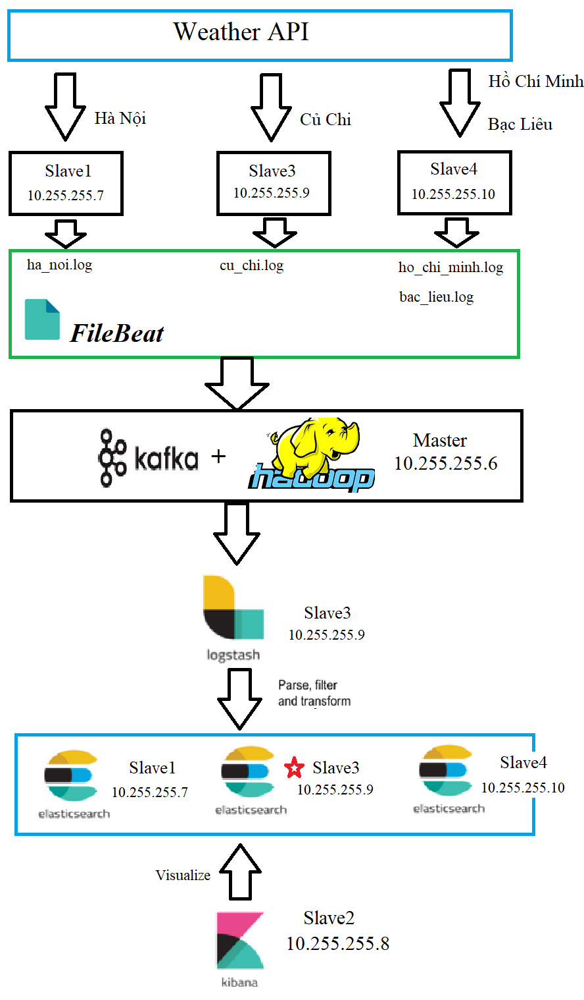
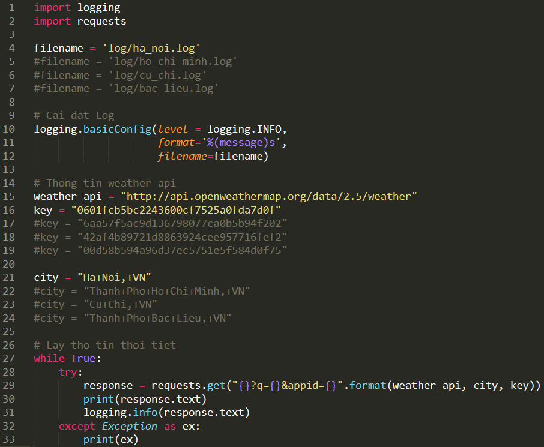

# real-time-weather
**Mục tiêu**: Xem thông tin thời tiết theo thời gian thực bằng các sử dụng Kafka và ELK (Filebeat, Lostash, Elasticsearch, Kibana)\
**Mô hình thực nghiệm**


Điều kiện ban đầu:
------------------
- Cấu hình cụm máy server:
  * master : **10.255.255.6**
  * slave1 : **10.255.255.7**
  * slave2 : **10.255.255.8**
  * slave3 : **10.255.255.9**
  * slave4 : **10.255.255.10**
- Cấu hình phần mềm Ambari:
  * Storages: **HDFS**
  * Resource Management: **YARN**
  * Management & Coordination: **ZOOKEEPER**
  * Streaming: **Kafka**
  * Khác: **Ambari Metrics**, **Zeppelin Notebook**

## Cấu hình Ambari


# Slave1
Cấu hình:
----------------
### Bước 1: Cài đặt các thư viện ELK (JAVA, Python Virtualenv, Elasticsearch, Filebeat)
Phần quyền thực thi cho file .sh
>```
>chmod +x real-time-weather/command/setup-slave1.sh
>```
Chạy script cài đặt
>```
>./real-time-weather/command/setup-slave1.sh
>```

### Bước 2: Cấu hình Elasticsearch tại /etc/elasticsearch/elasticsearch.yml
>```
>network.host: 10.255.255.7
>http.port: 9200
>
>cluster.initial_master_nodes: ["10.255.255.7"]
>```
>Tham khảo tại **config/elasticsearch.yml**

### Bước 3: Cấu hình Filebeat
>```
>sudo vim /etc/filebeat/filebeat.yml
>```
>Thiết lập dữ liệu đầu vô. \
>https://www.elastic.co/guide/en/beats/filebeat/master/filebeat-input-log.html
>```
>filebeat.inputs:
>- type: log
>  enabled: true
>  paths:
>    - /home/ubuntu/real-time-weather/weather/log/*.log
>  json.keys_under_root: true
>  json.add_error_key: true
>  json.message_key: log
>```
> Comment output.elasticsearch
>```
>#--------------------------- Elasticsearch output -------------------------
>#output.elasticsearch:
>  # Array of hosts to connect to.
>  #hosts: ["10.255.255.6:6667"]
>```
> Thiết lập dữ liệu đầu ra. \
> https://www.elastic.co/guide/en/beats/filebeat/master/kafka-output.html
>```
>#--------------------------------- Kafka output -------------------------------
>output.kafka:
>  hosts: ["10.255.255.6:6667"]
>  topic: 'weather'
>  partition.round_robin:
>    reachable_only: false
>  required_acks: 1
>  compression: gzip
>  max_message_bytes: 1000000
>```


# Slave2
Cấu hình:
----------------
### Bước 1: Cài đặt các thư viện ELK (JAVA, Kibana)
Phần quyền thực thi cho file .sh
>```
>chmod +x real-time-weather/command/setup-slave2.sh
>```
Chạy script cài đặt
>```
>./real-time-weather/command/setup-slave2.sh
>```


# Slave3
Cấu hình:
----------------
### Bước 1: Cài đặt các thư viện (JAVA, Python Virtualenv, Logstash, Filebeat)
Phần quyền thực thi cho file .sh
>```
>chmod +x real-time-weather/command/setup-slave3.sh
>```
Chạy script cài đặt
>```
>./real-time-weather/command/setup-slave3.sh
>```

### Bước 1: Cấu hình Logstash
>```
>sudo vim /etc/logstash/conf.d/weather.conf
>```
>```
>input {
>    kafka {
>        bootstrap_servers => ["10.255.255.6:6667"]
>        topics => ["weather"]
>        codec => json
>    }
>}
>
>filter {
>    json {
>        source => "log"
>    }    
>}
>
>output {
>    elasticsearch {
>        hosts => ["10.255.255.7:9200"]
>        manage_template => false
>        index => "weather"
>    }
>}
>```
> Tham khảo tại **config/logstash.conf**

### Bước 3: Cấu hình Filebeat
>```
>sudo vim /etc/filebeat/filebeat.yml
>```
>Thiết lập dữ liệu đầu vô. \
>https://www.elastic.co/guide/en/beats/filebeat/master/filebeat-input-log.html
>```
>filebeat.inputs:
>- type: log
>  enabled: true
>  paths:
>    - /home/ubuntu/real-time-weather/weather/log/*.log
>  json.keys_under_root: true
>  json.add_error_key: true
>  json.message_key: log
>```
> Comment output.elasticsearch
>```
>#--------------------------- Elasticsearch output -------------------------
>#output.elasticsearch:
>  # Array of hosts to connect to.
>  #hosts: ["10.255.255.6:6667"]
>```
> Thiết lập dữ liệu đầu ra. \
> https://www.elastic.co/guide/en/beats/filebeat/master/kafka-output.html
>```
>#--------------------------------- Kafka output -------------------------------
>output.kafka:
>  hosts: ["10.255.255.6:6667"]
>  topic: 'weather'
>  partition.round_robin:
>    reachable_only: false
>  required_acks: 1
>  compression: gzip
>  max_message_bytes: 1000000
>```


# Slave4
Cấu hình:
----------------
### Bước 1: Cài đặt các thư viện (JAVA, Python Virtualenv, Filebeat)
>Phân quyền thực thi cho file .sh
>```
>chmod +x real-time-weather/command/setup-slave4.sh
>```
>Chạy script cài đặt
>```
>./real-time-weather/command/setup-slave4.sh
>```

### Bước 2: Cấu hình Filebeat
>```
>sudo vim /etc/filebeat/filebeat.yml
>```
>Thiết lập dữ liệu đầu vô. \
>https://www.elastic.co/guide/en/beats/filebeat/master/filebeat-input-log.html
>```
>filebeat.inputs:
>- type: log
>  enabled: true
>  paths:
>    - /home/ubuntu/real-time-weather/weather/log/*.log
>  json.keys_under_root: true
>  json.add_error_key: true
>  json.message_key: log
>```
> Comment output.elasticsearch
>```
>#--------------------------- Elasticsearch output -------------------------
>#output.elasticsearch:
>  # Array of hosts to connect to.
>  #hosts: ["10.255.255.6:6667"]
>```
> Thiết lập dữ liệu đầu ra. \
> https://www.elastic.co/guide/en/beats/filebeat/master/kafka-output.html
>```
>#--------------------------------- Kafka output -------------------------------
>output.kafka:
>  hosts: ["10.255.255.6:6667"]
>  topic: 'weather'
>  partition.round_robin:
>    reachable_only: false
>  required_acks: 1
>  compression: gzip
>  max_message_bytes: 1000000
>```


# Các bước chạy mô hình
Khởi tạo topic trong Kafka tại Master:
---------------------------
>/usr/hdp/current/kafka-broker/bin/kafka-topics.sh --create \ \
>    --zookeeper localhost:2181 \ \
>    --replication-factor 1 \ \
>    --partitions 1 \ \
>    --topic weather

Kiểm tra Kafka:
----------------------------------------
>/usr/hdp/current/kafka-broker/bin/kafka-console-consumer.sh \ \
>    --bootstrap-server 10.255.255.6:6667 \ \
>    --topic weather \ \
>    --from-beginning

Lấy thông thời tiết theo thời gian thực tại Slave1, Slave3, Slave 4:
--------------------------------------------------------------------
### Bước 1: Chạy môi trường virtualenv
>```
>cd real-time-weather/weather
>source venv/bin/activate
>```
### Bước 2: Cài đặt các thư viện cho python
>```
>pip install -r requirements.txt
>```
### Bước 3: Cài đặt key API và nơi lấy nhiệt độ
> Chú ý: Đây là các key API miễn phí nên có hạng chế (60 lần / phút). \
> (https://openweathermap.org/price)



### Bước 4: Python lấy thông tin thời tiết qua API
>```
>python main.py
>```

Kết quả lấy thông tin thời tiết qua API:
----------------------------------------


Chay Filebeat
-------------------
Phần quyền thực thi cho file .sh
>```
>chmod +x real-time-weather/command/startFileBeat.sh
>```
Chạy script
>```
>./real-time-weather/command/startFileBeat.sh
>```

Kiểm tra Filebeat:
----------------------------------------
sudo /usr/bin/filebeat -c /etc/filebeat/filebeat.yml -e -d '*'

Khởi động Elasticsearch tại Slave1:
--------------------------------------------------------------------
Phần quyền thực thi cho file .sh
>```
>chmod +x real-time-weather/command/startElasticsearch.sh
>```
Chạy script
>```
>./real-time-weather/command/startElasticsearch.sh
>```

Khởi động Logstash tại Slave2:
-------------------
Phần quyền thực thi cho file .sh
>```
>chmod +x real-time-weather/command/startLogstash.sh
>```
Chạy script
>```
>./real-time-weather/command/startLogstash.sh
>```

Khởi động Kibana tại Slave3:
-------------------
Phần quyền thực thi cho file .sh
>```
>chmod +x real-time-weather/command/startKibana.sh
>```
Chạy script
>```
>./real-time-weather/command/startKibana.sh
>```


## Thông tin thời tiết theo thời gian thực


# Một số lệnh khác
Dừng Filebeat
-------------------
Phần quyền thực thi cho file .sh
>```
>chmod +x real-time-weather/command/stopFileBeat.sh
>```
Chạy script cho Filebeat
>```
>./real-time-weather/command/stopFileBeat.sh
>```

Dừng Kibana
-------------------
Phần quyền thực thi cho file .sh
>```
>chmod +x real-time-weather/command/stopKibana.sh
>```
Chạy script
>```
>./real-time-weather/command/stopKibana.sh
>```

Dừng Logstash
-------------------
Phần quyền thực thi cho file .sh
>```
>chmod +x real-time-weather/command/stopLogstash.sh
>```
Chạy script
>```
>./real-time-weather/command/stopLogstash.sh
>```

Dừng Elastisearch
-------------------
Phần quyền thực thi cho file .sh
>```
>chmod +x real-time-weather/command/stopElasticsearch.sh
>```
Chạy script
>```
>./real-time-weather/command/stopElasticsearch.sh
>```